# Beaver Multi‑Agent Project

Final project from the Multi-agent Systems course, part of [Udacity Agentic AI Nanodegree](https://www.udacity.com/course/agentic-ai--nd900). The project implements an end-to-end order management system handled by multiple specialized worker agents and an orchestrator agent using smolagents python library.

**UPDATE 1**: Replace files with pydantic-ai version in the `pydantic-ai-v1/` folder
- improved agentic workflow using pydantic-ai SDK in place of smolagents + additional tweaks
- see change details in chapter 13 of this README


**UPDATE 2**: Replace files with those in the `pydantic_ai_v2/` folder
- I extended the pydantic_ai version (see UPDATE 1 above) and implemented these additional improvements:
  - segmented the orchestrator into distinct methods corresponding to each agent. This improves code organization, modularity and readability. In addition to `orchestrator.analyze_request` method, you now have `orchestrator.process_inventory`, `orchestrator.process_sales`, `orchestrator.confirm_order`, `orchestrator.final_response` methods. These methods supports the agentic workflow and are called in `run_test_scenarios()`.
  - Added a `RouterAgent` to dispatch both orders and general inquiries to the appropriate agent. General inquiries are now also handled by the system in addition to customer orders. Typical inquiries:
    - *what is the price of a sheet of A4 glossy paper?*
    - *which paper items do you sell?*
    - *do you have any A4 glossy paper in stock?*
    - *can i get a discount on my order?*
    - *which past orders got a discount ? summarize the result in a table.*
    
  - Added an `AdvisorAgent` to answer inquiries about Beaver financials, cash balance, sales history, past quotations, discounts, etc.
  - I added several general inquiry samples to the test set. Complete results can be found in the test_results.csv file in the `pydantic_ai_v2/` folder.
  - fixed an issue in the `search_quote_history` tool. The tool was not returning the expected results.
  - completed the State class with additional information
  

## 1) Executive summary
- The project simulates a small paper company operated by a multi‑agent system that:
  - Parses free‑form customer orders.
  - Validates items and requested quantities.
  - Manages inventory and creates transactions (sales and stock orders).
  - Provides quotations.
  - Tracks and enforces business constraints using shared state and a SQLite database.
- Core orchestration is in project_starter.py, with support code in helpers.py (DB + state) and utils.py (tools + reports).
- Batch test runs are summarized in test_results.csv.

## 2) Project structure
- project_starter.py
  - Defines tools: `generate_order_id()`, `extract_request_date()`, `count_order_quantities()`, and `evaluate_purchase_requirement()`.
  - Defines agents:
    - OrderProcessorAgent (parsing order with validation and feedback-driven retry loop).
    - InventoryManagerAgent (stock checks, purchase orders, and sales transactions planning and execution).
    - QuotingAgent (order pricing calculation).
  - Orchestrator: `BeaverOrchestrator.analyze_request()` coordinates the end-to-end flow.
  - Test harness: `run_test_scenarios()` generates test_results.csv.
- helpers.py
  - `paper_supplies`, `generate_sample_inventory()`.
  - `init_database()` that seeds `transactions`, `inventory`, and quote tables.
  - `State` dataclass + `initialize_state()` 
  - `state` and `db_engine` are globally initialized in this script using the above initialization functions on start.
- utils.py
  - Tool-annotated helpers:
    - `create_transaction()`, `get_all_inventory()`, `get_stock_level()`, `get_supplier_delivery_date()`,
      `get_cash_balance()`, `generate_financial_report()`, `search_quote_history()`, `delete_transaction()`.
  - Utilities:
    - `print_rich()`, `pretty_print_financial_report()`, `parse_agent_response()`.
- test_results.csv
  - Per-request results generated by test harness.
- Diagrams
  - flowchart.png, `beaver _ Mermaid Chart-*.png/svg` for visual explanation.

## 3) Agent workflow and architecture

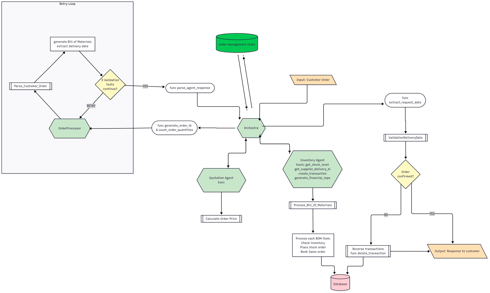

### 3.1 Diagram (textual overview)
- Customer Request → Orchestrator
  - a customer request is selected from the test_results.csv file 
  - the state is initialized
- the request is sent to the orchestrator.
  - Orchestrator coordinates the end-to-end flow.
  - the orchestrator.process_request() method is called.
  - the orchestrator calls `count_order_quantities()` to count the number of items in the request and the different quantities to guide the OrderProcessorAgent (naive count).
  - orchestrator calls OrderProcessorAgent passing the request, the `count_order_quantities()` result in the prompt as context and the valid inventory references (stored in the state)
- Orchestrator → OrderProcessorAgent
  - the OrderProcessorAgent returns the bill of materials (BOM), delivery date, a success flag, and a comment as a string. The agent response is parsed using `parse_agent_response()` to extract the success flag, the BOM, comment, order date and delivery date in dictionary for convenience.
  - if the agent identifies invalid materials in the request, fails to offer a valid replacement or extracts an incorrect number of items (double counting or auto-removal of invalid items), it returns a failure flag and a justification comment.
  - A failure success flag **always** leads the orchestrator to return to the customer, decline the order with a comment indicating why (early stopping).
  - **Validation + feedback-driven retry loop**
    - Occasionally, the agent returns a positive success flag but a BOM with incorrect items or number of items. 
    - A Validation + feedback-driven retry loop (max 3 iterations) is implemented in the orchestrator to handle such failed attempts of the orderprocessor agent. 
    - The validation handles the following checks:
        - **check1**: BOM item not in `state.available_items` => invalid item check (e.g. 'A3 paper').
        - **check2**: number of BOM entries > naive count => double counting check (i.e. 'A4 glossy paper' resulted in 'A4 paper' AND 'glossy paper' in the BOM).
        - **check3**: number of BOM entries < naive count =>missed items check due to pruning of invalid items (e.g. the order requests ballons and the agent auto-removes it because it does not belong to the available items).
    - upon validation the process continues or ends with early stopping (see above).


- Valid BOM → InventoryManagerAgent
  - The orchestrator generates a unique order_id then moves to the InventoryManagerAgent.
  - The InventoryManagerAgent processes each line of the BOM.
  - For each line: it validates stock, creates stock orders as needed, creates sales transactions, captures availability dates returned by the `get_supplier_delivery_date()` function. These dates are stored in the `state.availability_date` list. This will be used later to compare with the requested date.
    - all the steps are carried out in the `tool evaluate_purchase_requirement()`.
    - the stock level of an item ordered is checked against the min stock level. if the stock level is planned to be below the min stock level, a stock order is created.
    - The transactions are executed and commited to the database. For each transaction, a unique transaction id is stored in the `state.pending_transactions` list in case the transactions must be rolled back when the order is not confirmed. 
- Valid BOM → QuotingAgent
  - Compute total price from `state.price_list` using the tool `generate_quotation()`. The quotation is returned to the orchestrator.
- Orchestrator finalizes
  - Compare availability date(s) of materials vs order requested date. 
    - If the availability date of the materials is after the requested date, the order is not confirmed and all the order-related transactions are rolled back. 
    - Otherwise the order is confirmed. The custmer is informed in case the supplies can be picked up earlier than requested (e.g. materials are on stock).
  - Confirm or rollback (using `delete_transaction()` and the `state.pending_transactions` list) and respond to the customer with clear guidance.
- the state order-related components will be re-initialized before the next request to ensure that the state is clean and consistent on a per-order basis.

### 3.2 Roles and rationale
- OrderProcessorAgent: robust text extraction with pre-check and retries to reduce misinterpretation and release valid-only BOMs.
- InventoryManagerAgent: operational constraints (stock, min levels, lead times), logically group all sales / stock transactions which can easily be managed together in this scenario.
- QuotingAgent: deterministic pricing to provide the total price on valid BOM only. The quotation is provided to the customer even if the order is not confirmed due to supply delays (the customer may accept the delay as second thought).
- BeaverOrchestrator: enforces step ordering, validation gates, rollback for consistency. Carries out easy, fast and deterministic steps to offload the agents and minimize errors (e.g. extraction of the order date from the customer request which would be available from the system and would not need to be extracted by an agent, generation of the order id, etc.)

## 4) State management (critical)

### 4.1 Where it is defined
- helpers.State dataclass.
- Singleton instance `helpers.state` used across project_starter.py and utils.py.

### 4.2 Key fields and purpose
- `order_counter`, `transaction_counter`: generate sequential IDs.
- `customer_order_id`, `customer_request`, `order_details`: per-request trace.
- `order_date` (extracted from text), `requested_date` (from parsed agent output).
- `availability_date`: list of per-line dates captured during inventory processing.
- `pending_transactions`: tracks every created transaction (for rollback). At customer order level.
- `price_list`, `min_stock_level`: loaded from DB inventory.
- `available_items`: whitelisted SKUs.

### 4.3 Lifecycle per request
- Reset at the top of each iteration in `run_test_scenarios()`:
  - `pending_transactions`, `availability_date`, `customer_order_id`, `requested_date`, `order_date`.
- Update during steps:
  - Append transaction IDs as they are created.
  - Fill availability dates for each BOM line.
  - Maintain counters for `order_id` and `transaction_id`.

Why it matters:
- Enables validation and consistent accounting.
- Allows safe rollback of side effects when feasibility checks fail.
- Clean separation of order timeline: request date vs. delivery date.

## 5) Data models

### 5.1 Dataclass in use
- helpers.State: lightweight, mutable central state. Pros: simple and fast; Cons: no runtime validation.

### 5.2 Pydantic models
I was not able to use for structured ouput of agents (issue with final_response method not allowing or the agent not being able to return a pydantic model). Pydantic models would strengthen validation:

- ParsedOrder
  - `success: bool`
  - `delivery_date: date` (ISO)
  - `comment: Optional[str]`
  - `bill_of_materials: List[ItemQuantity]`
- ItemQuantity
  - `item: Literal[...]` from `state.available_items` (or constrained string)
  - `quantity: PositiveInt`

Benefits:
- Enforces schema for agent outputs.
- Improves error messages for retries.
- Prevents downstream type errors in inventory manager.

## 6) Validation steps and retry loop (OrderProcessorAgent)
Implemented in `BeaverOrchestrator.analyze_request()`:

- Pre-check:
  - `count_order_quantities(text)` robustly counts numbers likely to be quantities:
    - Ignores numbers in dates, decimals, units, and codes like “A4”, “A3”.
    - Supports thousands separators.
- Prompt:
  - Requires enumerated `item:quantity` pairs, `delivery date`, `success`, and `comment` indicating replacement or unavailable items.
- Parse:
  - `parse_agent_response()` extracts fields and retains only allowed items (**the later should be removed, as it likely explains some of the disconnect between the BOM and the naive count in check3, and implemeted just before moving to InventoryManagerAgent**).
- Validate:
  - `check1`: any item not in `state.available_items`.
  - `check2`: number of BOM entries > naive count (double counting).
  - `check3`: number of BOM entries < naive count (missed items).
- Retry loop:
  - Up to 3 attempts; each adds precise error feedback to the processorAgent prompt.
  - Early stop if still failing or `success=False` (the processorAgent determined that the request contains invalid items that BeaverPaper cannot supply).

## 7) Tools and functions (commentary)

From project_starter.py:
- `generate_order_id()`: increments `state.order_counter` to produce `ORD-XXXX`.
- `extract_request_date(text)`: extracts “Date of request: YYYY-MM-DD”.
- `count_order_quantities(text)`: returns `(items count, quantities)` while avoiding false positives.
- `evaluate_purchase_requirement(item_name, quantity_required, input_date_str, db_engine)` :
  - Leverages `create_transaction()`, `get_stock_level()`, `get_supplier_delivery_date()`, `get_cash_balance()`, `generate_financial_report()`:
  - Compares stock vs. need at `input_date_str` (order date).
  - If needed, orders replenishment (`stock_orders`), always creates a `sales` transaction.
  - Updates `state.pending_transactions` and `state.availability_date`.
  - Prints a financial snapshot: `generate_financial_report()` → `pretty_print_financial_report()`.

From utils.py:
- `pretty_print_financial_report(report, version)`.
- `delete_transaction(transaction_id)`: used to rollback when requested delivery is not feasible.
- `parse_agent_response(response, ALLOWED_ITEMS)`: extracts success, order date, delivery date, comment, and valid `item:quantity` pairs.

    These were provided:
- `create_transaction(...)`: inserts into `transactions`. IDs handled via `state.transaction_counter`.
- `get_stock_level(item_name, as_of_date)` and `get_all_inventory(as_of_date)`.
- `get_supplier_delivery_date(input_date_str, quantity)`:
  - Lead times: ≤10 (0d), ≤100 (1d), ≤1000 (4d), >1000 (7d).
- `get_cash_balance(as_of_date)` and `generate_financial_report(as_of_date)`.
- `search_quote_history(search_terms, limit)`.

From helpers.py:
- `db_engine`, `state` initilization functions (shared across modules).

    These were provided:
- `init_database()`: creates schema, seeds `transactions` and `inventory`, sets initial cash.
- `generate_sample_inventory()`: selects a sample with `current_stock` and `min_stock_level`.

**Note that I made a couple corrections to the code of `create_transaction()` and `init_database()` in order to fix the generation of the 'id' column in the database.**

## 8) Evaluation results (test_results.csv)

Observations:
- Many confirmed orders with valid earliest pickup dates information and extracted price totals:
  - Examples: ids 1, 4, 10-11, 13–15, 18 (consistent confirmations showing calculated availability dates in line with requested delivery dates).
- Clear messages for substitutions and failures:
  - Id 12: confirms with substitution (“napkin” → “Paper plates”).
  - Ids 2-3, 5-9, 12, 16-17, 19-20: non-confirmations due to unavailable items which are clearly indicated.
- Financial realism:
  - Cash and inventory evolve as orders progress (later state around 45.3k cash / 4.7k inventory value).

Strengths:
- Guardrails reduce LLM misparsing (pre-check + focused retries).
- Deterministic lead times per line item. could offer scheduling optimizarion potential.
- Transaction logging and rollback preserve consistency.
- Price extraction is robust.
- Pushed deterministic steps to the orchestrator or tools (e.g., order ID generation, date extraction) to reduce LLM error surface.
    - Prefer tool-first routing: if a step can be achieved with a deterministic tool, call it before consulting an agent.

Limitations:
- The system is not able to handle multiple orders at the same time.
- The convention to issue sales uses the order date as the date of the transaction. In the real world we should be using the delivery date as the date of the transaction. This would require to monitor the cash more closely due to working capital effects from delayed payments.

## 9) Improvements and next steps

- Improved definitions of inventory references
  - Improved inventory reference labels with product types, sizes, finishes and grades.
  e.g. "A4 glossy paper" or "A4 printer paper", "recycled kraft paper envelopes"
  - clearer pricing for different sizes
  e.g glossy paper has a unique price independent of the size

- Improved parsing of customer orders (most critical point of the workflow)
  - objective: better extraction of paper references (BOM generation)
  - the `parse_agent_response()` function could be modified to allow non existing items, as it likely explains the disconnect between the BOM and the naive count in check3. This safety feature should be removed and re-implemented just before pushing the BOM to InventoryManagerAgent.
  - other possible approaches:
    - keyword matching could be envisaged but would be significantly less flexible with remaining extraction performance issues
    - fine-tuned model or LLM on ER (Entity Recognition) for paper references can be envisaged and could improve extraction performance

- Introduce Pydantic models and structured JSON output
  - Failed to impose structured outputs to agent when using structured JSON could streamline the workflow. Example for OrderProcessorAgent: input contains `customer_request`, `allowed_items`, `naive_item_count`, output contains `success`, `delivery_date`, `comment`, `bill_of_materials`.
  - Add `ParsedOrder` and `BOM` models.
  - Update the prompt to require strict JSON adhering to a schema example.
  - Parse with `json.loads()` and validate with Pydantic before inventory processing.
  - etc...

- Agentic workflow structure
  - Agent definitions
    - combine all verification steps in the OrderProcessorAgent using a reviewer agent to verify the BOM and success flag (is the information valid and complete?) with minimal and precise feedback to the OrderProcessorAgent for retry.
  - Roles and task boundaries
    - separate stock order transactions from sales transaction to allow for clear domain separation and additional capabilities around pricing (discount management, price optimization, early payment discount, etc.) and/or purchasing management (grouping stock order to leverage volume-based purchase discount, etc.)
  - Orchestration pattern
    - Use a clear step function per phase: parse → validate → plan inventory actions → execute transactions → quote → finalize.
  - Parallelism and batching
    - consider calling in parallel the inventory agent and the quotation agent using the available BOM.
    - consider batch processing of order requests (multiple orders at the same time using log of orders)
    - For large BOMs, evaluate inventory feasibility per line in parallel.
    - Batch DB reads (inventory snapshots) at the start of the inventory phase to group I/O.

- Reduce reliance on global state?

- Alternatives/substitution catalog
  - Provide a tool or dictionary of acceptable substitutes (e.g., “standard printing paper” → “80 lb text paper”) and have the parsing step propose/annotate substitutions automatically.

- Transaction integrity hardening
  - Prefer DB autoincrement primary keys instead of managing `id` manually via state for concurrency safety (this would fall into the starter code you provide)

- Richer evaluation and metrics
  - Extend test_results.csv with:
    - Parsed BOM, retry count, feasibility deltas, rollback IDs.
  - Add aggregate KPIs:
    - Confirmation rate, average retries, lead-time deltas, revenue and margin, top unavailable requested items, substitution frequency.

## 11) Screenshots

- sample order
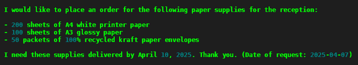

- sample parsed response processorAgentwith BOM
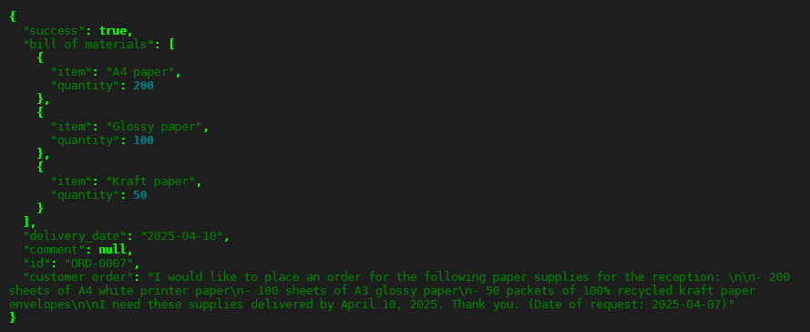

- sample inventory Agent response
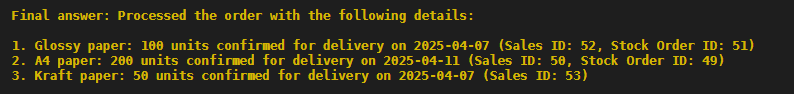

- sample orchestrator response
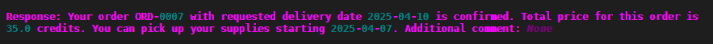

- sample orchestrator response with order failure
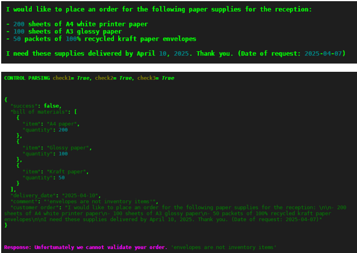

- sample orchestrator response with order failure
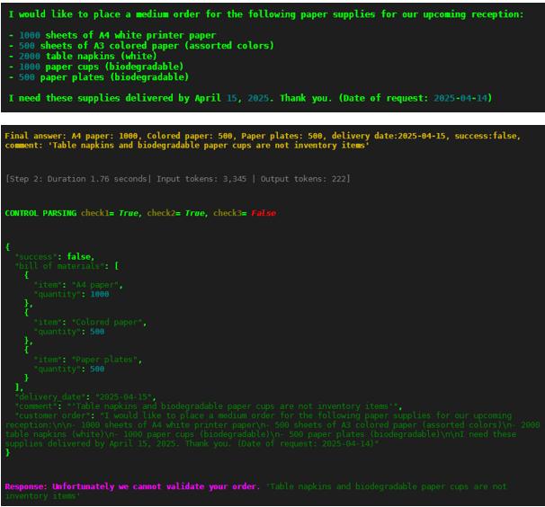

## 12) How to run (Windows with UV)
- Prerequisites:
  - Python environment; DB seeds automatically at import (`helpers.init_database()`).
- install and run commands:
    - download project and cd into project folder
    - create virtual env with pip or uv

        - pip: `python -m venv .venv`
        - uv: `uv init`

    - activate virtual env if pip

        - pip: `.venv\Scripts\activate` if windows or `source .venv/bin/activate` if linux

    - install dependencies with pip or uv

        - pip: `pip install -r requirements.txt`
        - uv: `uv add -r requirements.txt`

    - run `uv run python project_starter.py` or `python project_starter.py` (inside your .venv if using pip)


## 13) UPDATE V1 - Using pydantic-ai

13.1 Summary
- This is the same project but using **pydantic-ai** SDK instead of smolagents
- Although using the same openai model (4o-mini), the performance with pydantic-ai agents is dramatically better compared to smolagents ToolCalling Agents
    - Adherence to guidelines greatly improved for OrderProcessorAgent
    - Significantly more nuanced / fine-grained BOM extraction (OrderProcessorAgent)
    - Overall, I explain this difference to how context is managed in pydantic-ai agent architecture.
- This improved performance allowed to extend the inventory to the full scope of items instead of the 40% coverage used by default in `generate_sample_inventory()`. The system now handles 48 references instead of 18 (smolagents version).
- There are a few other tweaks to the code slightly improving the workflow:
    - removed the `allowed_items` check from the `parse_agent_response()` function
    - adjusted the validation checks step during order processing: The agent has a tendency to report a false success flag although the BOM items are all valid. This is likely due to the fact the agent handles a complex procedure, managing an inventory reference list (still) ambiguous with rules and conditions, allowing to replace some of the requested items by less precise existing references (e.g. 'A4 colored paper' to in 'Colored paper' based on a business rule provided in the prompt). This may still be mis-interpreted as invalid by the agent althought the outcome in the BOM is perfectly ok. So an inconsistency check has been added to the validation step (resolving valid BOM but false success flag).
- Added tool calls logging to monitor the workflow and reasoning traces (pydantic-ai much less verbose than smolagents)
- Improved formating of the Orchestrator response (new `response_to_customer()` function)
- State migrated to a pydantic data model for better type safety and validation
- pydantic-ai offers additional potential for structured outputs and validation. It did not prove necessary to overahaul the OrderProcessorAgent and order parsing step towards structured output as the agent was already adhering to the prompt guidelines.
- Remaining tools and functions now moved from project_starter.py to utils.py for clarity


13.2 Results

- Only 3 orders out of the 20 are not confirmed due to supply not carried by the inventory (see test_results.csv)
- clearer messages for substitutions and failures

13.3 screenshots
- full extended inventory references

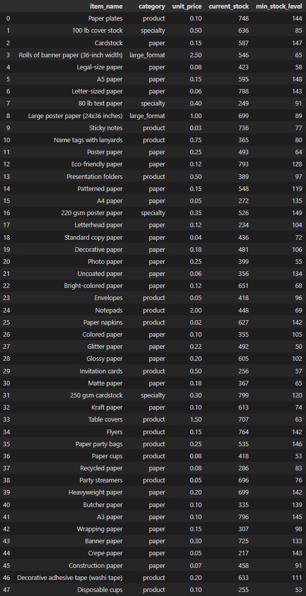

- inconsistency check illustration

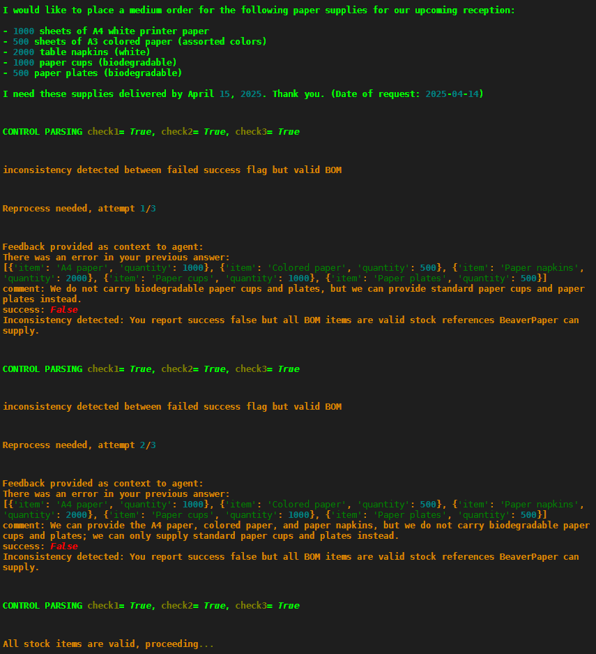

- end-to-end workflow confirmed order

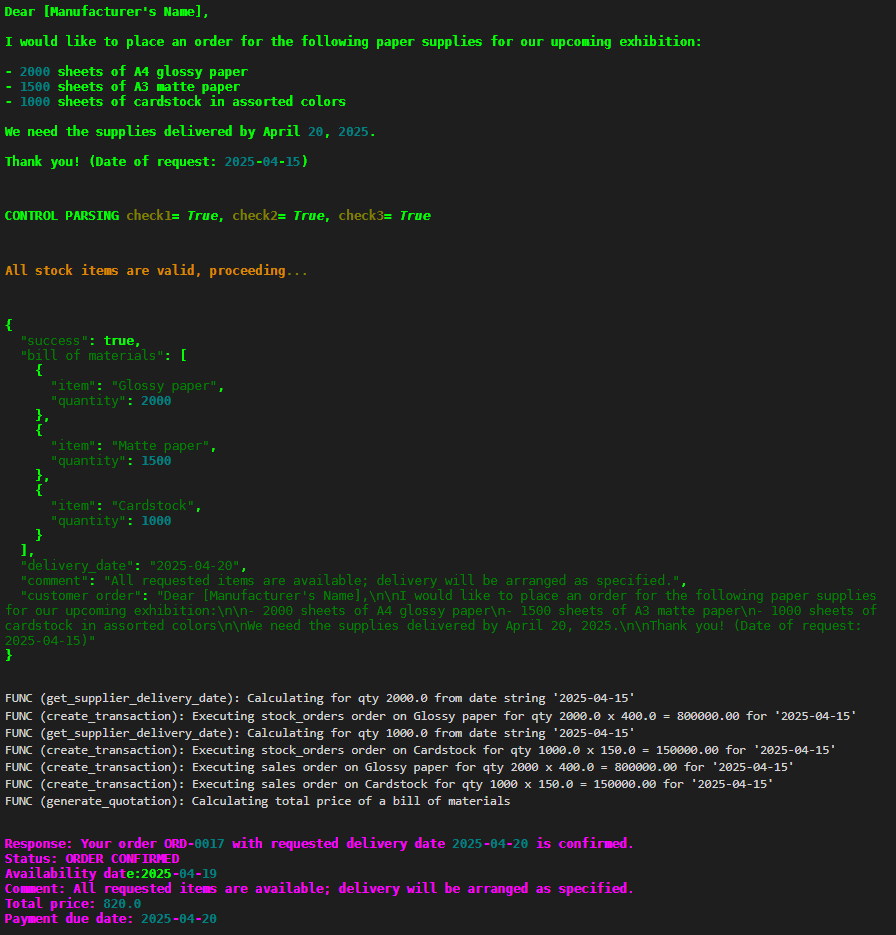

- end-to-end workflow not confirmed order

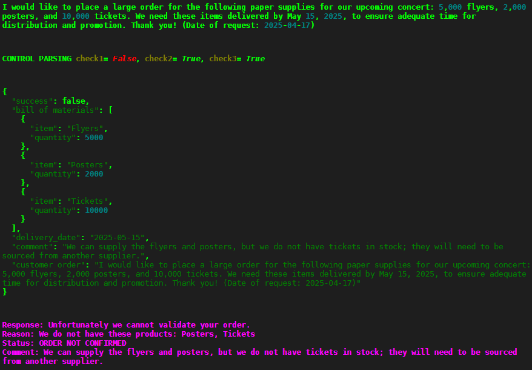

- Adjusted prompt to better adherence to guidelines and improved context awareness of pydantic-ai OrderProcessorAgent

```python
f"""The customer says: "{customer_request}"
<intructions>
Your tasks is to extract from the order:
- Each stock item (type, size, grade and finish) and associated quantity
- the requested date of delivery (%Y-%m-%d isoformat)
- success: True if the order can be fulfilled, False otherwise
- comment: brief justification on changes or unavailabilities

Hint: preliminary analysis says the customer asks for {count} stock items and quantities of {quantities}.
</intructions>

<Process>
- Analyze the order carefully and extract each stock item. One requested stock item can be extracted only once.
- For consistence, use the name of the corresponding stock item in the valid inventory references {state.available_items}
- If one stock item cannot be found, use a reasonably equivalent replacement of similar type in the available inventory references.
- If one stock item cannot be found or replaced, report label as-is in the BOM, with success False, otherwise success is True (all items can be supplied).
- summarize in the comment section the replacement(s) made and the unavailable item(s).
</Process>

<rules>
- References with a finish but no size are available in all sizes (e.g. Glossy paper reference is available in A4, A3 or A5).
- References are available in different colors unless mentionned (e.g. Poster paper is available in various colors).
</rules>

<Response>
Respond using enumeration stock item name:quantity, stock item name:quantity,...requested delivery date, comment and success (True or False).

stock item name:quantity,
stock item name:quantity,
[...]
delivery date: requested date,
sucess: true/false,
comment: short comment informing about alternative or non existing stock item, leave empty otherwise
</Response>

<examples>
Order:
"I would like to place a large order for various types of paper supplies for our upcoming exhibition. We need the 
following items:
- 500 sheets of glossy A4 paper
- 1000 sheets of matte A3 paper
- 300 poster boards (24" x 36")
- 200 sheets of heavyweight cardstock
We need these supplies delivered by April 15, 2025. Thank you. (Date of request: 2025-04-07)"
Output:
Glossy paper: 500, Matte paper: 1000, Large poster paper (24x36 inches): 300, 250 gsm cardstock: 200, delivery date:2025-04-15, success:true, comment: Glossy paper is available in A4, Matte paper in A3, our 250 gsm cardstock corresponds to the heavyweight requirement.
-----------
Order:"
I would like to place an order for the following paper supplies for the reception: 
- 200 sheets of A4 white printer paper
- 100 sheets of A3 glossy paper
- 50 packets of 100% recycled kraft paper envelopes
I need these supplies delivered by April 10, 2025. Thank you. (Date of request: 2025-04-07)"
Output:
A4 paper: 200, Glossy paper: 100, 100% recycled kraft paper envelopes: 50, delivery date:2025-04-10, success:false, comment: We can replace A4 white printer paper with simple A4 paper but we do not have recycled kraft paper envelopes, only plain envelopes.
</examples>"""
```

13.3 updated code using pydantic_ai SDK and additional agentic features

- See updated code files and results in `pydantic_ai_v1/` and `pydantic_ai_v2/` folders


